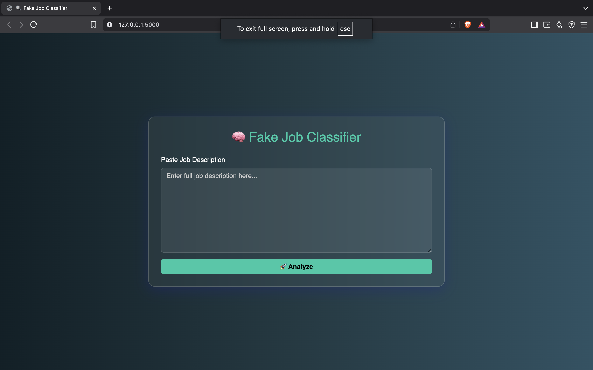
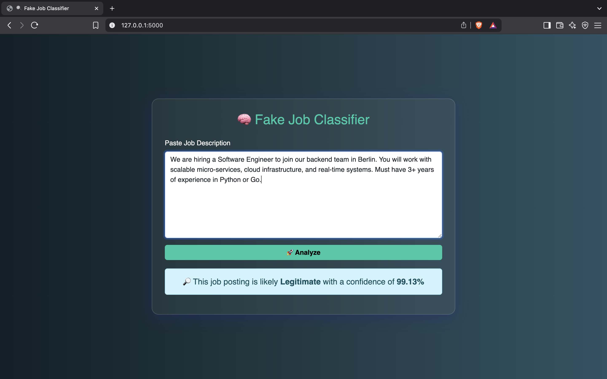

## Screenshots

### Before Prediction


### After Prediction


---

# Fake Job Posting Classifier

A Deep Learning-based web application that detects whether a job posting is **legitimate** or **fraudulent** based on the job description. It uses an LSTM neural network trained on real-world data to make accurate predictions.

---

## Problem Statement

With the rise in online job platforms, fake job postings have become a serious issue. This project aims to create a model that can automatically classify job descriptions as either **genuine** or **fraudulent**, helping protect users from scams.

---

## Technologies Used

- **Python**
- **Pandas, NumPy** – Data preprocessing
- **TensorFlow / Keras** – LSTM Model
- **Scikit-learn** – Utilities & evaluation
- **Flask** – Web framework for deployment
- **HTML + Bootstrap** – Frontend interface

---

## Model Overview

The classifier uses an LSTM (Long Short-Term Memory) network which is well-suited for sequence and text classification tasks.

### Achieved Accuracy: `~97%`

Despite a highly imbalanced dataset, techniques like **early stopping** and **class weighting** were used to prevent overfitting and improve recall for the minority class.

---

### Project Structure

```bash
├── app.py                     # Flask app
├── evaluate_model.py
├── model_training.py          # Model training script
├── data/
│   └── cleaned_fake_job_postings.csv
├── saved_model/
│   ├── fake_job_lstm_model.keras
│   └── fake_job_tokenizer.pkl
├── templates/
│   └── index.html
├── static/
│   └── (optional styling/images)
├── requirements.txt
├── README.md
└── .gitignore
```

## How to Run

### Setup
```bash
git clone https://github.com/your-username/fake-job-classifier.git
cd fake-job-classifier
pip install -r requirements.txt
```

### 📌 Note
This model was trained on a dataset where only ~5% of job postings were labeled as fraudulent. While efforts were made to address this imbalance (e.g., class weighting), predictions may still be biased toward legitimate postings. This project is intended for educational and demonstrative purposes and should not be used as a sole decision-making tool in real-world recruitment workflows.


