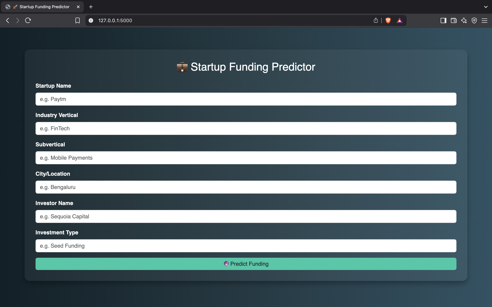
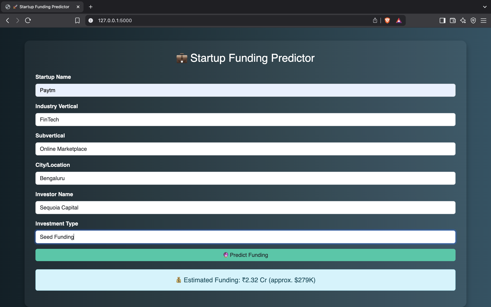

## Screenshots

### Before Prediction


### After Prediction


---

# Startup Funding Predictor

This is a Flask-based web application that predicts the estimated funding amount a startup might receive based on key input features like startup name, industry, subvertical, city, investor, and investment type.

---

## Tech Stack

- Python 
- Flask 
- Keras (TensorFlow backend) 
- Scikit-learn (for preprocessing) 
- HTML + Bootstrap 

---

## Model Input Features

The model was trained on 8 input features:
1. sr_no (auto-filled)
2. startup_name
3. industry_vertical
4. subvertical
5. city__location
6. investors_name
7. investmentntype
8. remarks (auto-filled)

---

## How It Works

1. User fills out the form with the startup details.
2. Inputs are encoded and scaled using saved LabelEncoders and a StandardScaler.
3. The trained ANN model predicts the funding amount.
4. Result is displayed in **INR (Cr)** and **USD (K)**.

---

## Sample Input to Test

- **Startup Name**: Flipkart  
- **Industry Vertical**: E-Commerce  
- **Subvertical**: Online Marketplace  
- **City/Location**: Bengaluru  
- **Investor Name**: Accel Partners  
- **Investment Type**: Series B  

---

## Folder Structure
```bash
startup-funding-predictor/
├── app.py
├── requirements.txt
├── saved_model/
│   ├── ann_model.keras
│   ├── scaler.pkl
│   └── label_encoders.pkl
├── templates/
│   └── index.html
├── .gitignore
└── README.md
```
---

## 🔧 Setup Instructions

```bash
# Clone the repo
git clone https://github.com/your-username/startup-funding-predictor.git
cd startup-funding-predictor

# (Optional) Create a virtual environment
python -m venv venv
source venv/bin/activate  # On Windows: venv\Scripts\activate

# Install dependencies
pip install -r requirements.txt

# Run the app
python app.py

